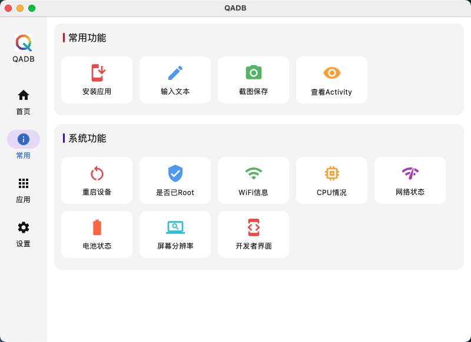

# ADB Tool GUI

一个基于 **Jetpack Compose Multiplatform** 开发的 ADB 图形化工具，支持 **Windows** 和 **macOS** 平台。通过可视化界面进行常用 ADB 操作，无需手动输入命令，简单高效。

---

## ✨ 功能特点

- 🚀 快速识别已连接的设备
- 🧾 查看设备详细信息（型号、版本、状态等）
- 📱 对设备进行操作（重启、关机、截屏等）
- 📦 管理设备中的应用（安装、卸载、清除数据等）
- 🔌 即插即用，自动检测设备变化

---

## 🖥 支持平台

- Windows
- macOS

---

## 📦 下载地址

前往 [GitHub Releases](https://github.com/ludoven/QAdb-Multiplatform/releases) 下载最新版本的 QAdb：

- Windows: 下载 QAdb.exe 或 QAdb.msi
- macOS: 下载 QAdb.dmg

---

## 📷 截图预览

---

## ❗️使用说明

1. 电脑需安装 [ADB](https://developer.android.com/tools/adb) 并配置环境变量；
2. 启动软件后自动加载已连接设备；
3. 选中设备即可进行相关操作。

---

## 📮 反馈建议

如果你在使用过程中发现问题或有功能建议，欢迎通过 Issues 反馈。

---

## 📌 声明

本项目为图形化封装工具，未包含或修改 ADB，本工具依赖系统中已有的 adb 工具运行。
